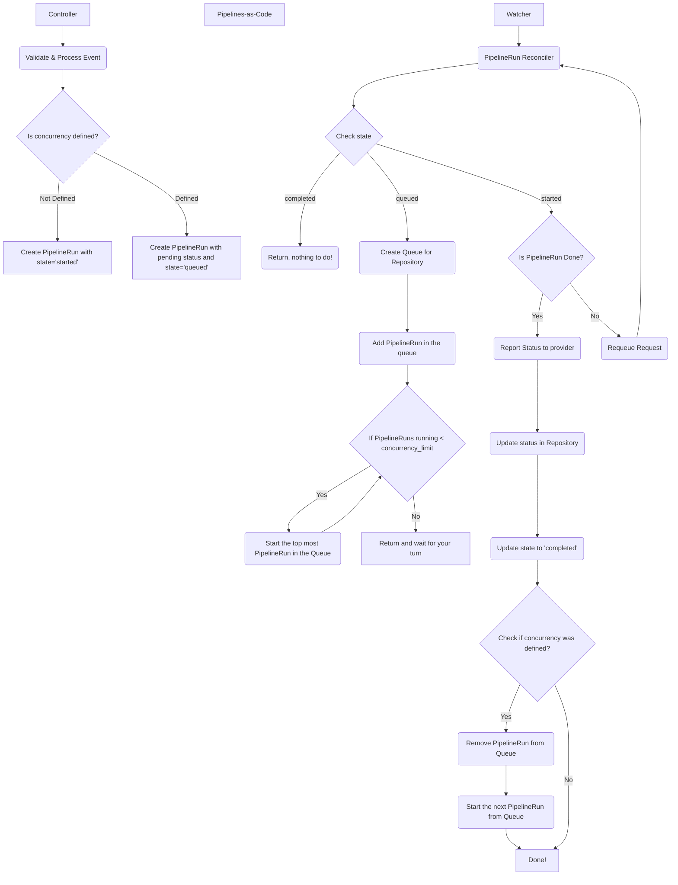

This page illustrates how Pipelines-as-Code manages concurrent PipelineRun execution. When you set a concurrency limit on a Repository CR, Pipelines-as-Code queues incoming PipelineRuns and starts them only when capacity allows.

## Flow diagram



## Inspecting the queue at runtime

Every concurrency bug is the same shape: what the watcher believes is running
drifts away from what is really running in the cluster. When a repository's
queue looks stuck — nothing starting, or more running than the configured
`concurrency_limit` — the fastest way to find out why is to ask the watcher
directly instead of guessing from PipelineRun status.

The watcher can serve a read-only, JSON snapshot of its in-memory queues on
`/debug/queue`, on the same port it already uses for its health probe.


This endpoint is disabled by default and must be explicitly enabled. It is
unauthenticated: anything that can reach the watcher pod on its probe port
(any workload in the cluster with network access to it, not just cluster
API clients) can read the namespace, Repository name, and pending/running
PipelineRun names for every repository the watcher knows about. Only turn it
on for troubleshooting, and turn it back off afterward.


### Enabling it

Set `PAC_ENABLE_QUEUE_DEBUG=true` on the `pac-watcher` container in the
`pipelines-as-code-watcher` Deployment, then restart the pod:

```shell
kubectl -n pipelines-as-code set env deployment/pipelines-as-code-watcher \
  -c pac-watcher PAC_ENABLE_QUEUE_DEBUG=true
```

Unset it (or set it to `false`) to disable the endpoint again:

```shell
kubectl -n pipelines-as-code set env deployment/pipelines-as-code-watcher \
  -c pac-watcher PAC_ENABLE_QUEUE_DEBUG-
```

### Querying it

The endpoint is not exposed by the watcher Service (which only serves
metrics), so reach it through the pod itself. The API server's pod proxy does
not resolve named container ports, so use the numeric port (`8080` by
default, or whatever `PAC_WATCHER_PORT` is set to):

```shell
POD=$(kubectl -n pipelines-as-code get pods -l app.kubernetes.io/name=watcher -o jsonpath='{.items[0].metadata.name}')

# through the API server's pod proxy (what "kubectl proxy" exposes too)
kubectl get --raw "/api/v1/namespaces/pipelines-as-code/pods/http:${POD}:8080/proxy/debug/queue" | jq .

# or port-forward straight to the pod
kubectl -n pipelines-as-code port-forward "pod/${POD}" 8080:8080 &
curl -s localhost:8080/debug/queue | jq .
```

The response is a map keyed by `namespace/repository`:

```json
{
  "my-namespace/my-repo": {
    "limit": 1,
    "running": ["my-namespace/pr-run-2"],
    "pending": ["my-namespace/pr-run-3", "my-namespace/pr-run-4"]
  }
}
```

A few things to look for:

- `len(running)` should never exceed `limit`.
- A repository key that never disappears after all of its PipelineRuns have
  finished means a queue slot was leaked, and the next run for that
  repository will never start until the watcher restarts.
- `pending` staying non-empty while `running` is empty for longer than
  expected means the queue has stalled.

The endpoint answers `503` while the watcher is busy reconciling, because it
gives up on the queue lock rather than block the work it is reporting on. That
is normal under load — just ask again.
